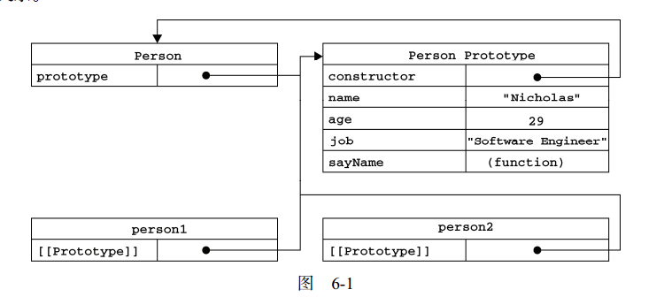

- 工厂模式

> 依赖一个对象的 constructor 属性并不安全, 对于原始值（如1，true 或 "test"），该属性为只读。

- 构造函数模式

- 原型模式

> 无论什么时候，只要创建了一个新函数，就会根据一组特定的规则为该函数创建一个 prototype
属性，这个属性指向函数的原型对象。在默认情况下，所有原型对象都会自动获得一个 constructor
（构造函数）属性，这个属性包含一个指向 prototype 属性所在函数的指针。

``` javascript

function Person(){}
Person.prototype.name = "Nicholas";
Person.prototype.age = 29;
Person.prototype.job = "Software Engineer";
Person.prototype.sayName = function() {
    alert(this.name);
};

```
> 就拿前面的例子来说，
Person.prototype. constructor 指向 Person。而通过这个构造函数，我们还可继续为原型对象
添加其他属性和方法。

<p align="center">
  
</p>

> 虽然可以通过对象实例访问保存在原型中的值，但却不能通过对象实例重写原型中的值。如果我们
在实例中添加了一个属性，而该属性与实例原型中的一个属性同名，那我们就在实例中创建该属性，该
属性将会屏蔽原型中的那个属性。

## in

如果指定的属性存在于指定的对象中(无论该属性存在于实例中还是原型中)，则 in 运算符会返回 true。

## Object.keys() 和 Object.getOwnPropertyNames() 获取属性

- Object.keys() 方法会返回一个由给定对象的所有可枚举自身属性的属性名(原型链的属性不包括)组成的数组。

- Object.getOwnPropertyNames()方法返回一个由指定对象的所有自身属性的属性名(包括原型链的属性)（包括不可枚举属性）组成的数组。

``` JavaScript

function Person() {}
Person.prototype = {
    name: "Nicholas",
    age: 29,
    job: "Software Engineer",
    sayName: function() {
        alert(this.name);
    }
};

```

> 在上面的代码中，我们将 Person.prototype 设置为等于一个以对象字面量形式创建的新对象。
最终结果相同，但有一个例外： constructor 属性不再指向 Person 了。前面曾经介绍过，每创建一
个函数，就会同时创建它的 prototype 对象，这个对象也会自动获得 constructor 属性。而我们在
这里使用的语法，本质上完全重写了默认的 prototype 对象，因此 constructor 属性也就变成了新
对象的 constructor 属性 （指向 Object 构造函数），不再指向 Person 函数。

- 实例一般都是要有属于自己的全部属性的。
